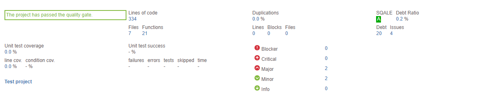

# Sonarqube statistics bitbucket application
[/statusIcon)](https://1node.beta.teamcity.com/viewType.html?buildTypeId=BitbucketSonarStats_Build&guest=1)
[](https://sonarcloud.io/dashboard?id=1node-Solutions_bb-sonar-stats)


This app shows Sonarqube statistics from SonarQube servers or SonarCloud.  



## Table of Contents
1. [About](#About)
2. [Bitbucket-app-registration](#Bitbucket-app-registration)
2. [Running](#Running)
3. [Building](#Building)
4. [Configuration](#Configuration)

## About
This app shows SonarQube statistics for Bitbucket repositories like test code issues, test coverage, code duplication. This app also highlights the failed quality gates. All metrics are linked to SonarQube's Web UI. It works with public and private SonarQube servers (tested with sonar server 7.9.4 ) and possibly SonarCloud (not tested yet).

Please note that in order to have this app available in all repositories of your team, you have to install it on the team account.

## Bitbucket-app-registration
1. Go to your bitbucket organization/account settings
2. OAuth consumers - Add consumer
3. Fill in details, check `This is a private consumer` checkbox, choose scopes: `account: read`, `repositories: read`
4. Save oauth key and secret
5. Go to Installed apps, enable Development mode
6. Go to Develop apps - Register app, enter app url, register app
7. Click on installation url and grant access to the app

## Running
1. Prepare `config.toml` file. 
2. `docker pull 1node/bb-sonar-stats:latest`
3. `docker run -itd -v </path/to/config.toml>/config.toml:/app/config.toml -p <app_port>:9001 1node/bb-sonar-stats:latest`

`config.toml` example: 
```
baseUrl = https://bb-sonar-stats.1node.xyz
port = 8080
logLevel = "info"
organization = "1node"

bitbucketOauthKey = <bitbucket oauth key>
bitbucketOauthSecret = <bitbucket oauth secret>
repoBranch = "master"

sonarConfigPath = "sonar.json"
```

| Key                  | Value description                                                                                 |
|----------------------|---------------------------------------------------------------------------------------------------|
|              baseUrl | Domain mapped to your application.                                                                |
| port                 | Port on which your application listening.                                                         |
| logLevel             | Logging level. Possible values: `debug`, `info`, `warning`, `error`, `fatal`, `panic`.            |
| organization         | Your organization name. You need to fill in this field to make bitbucket app descriptor unique.   |
| bitbucketOauthKey    | Bitbucket oauth key from oauth key registration.                                                  |
| bitbucketOauthSecret | Bitbucket oauth secret from oauth key registration.                                               |
| repoBranch           | Main branch of your repo. For example: `main`, `master`, `production`.                            |
| sonarConfigPath      | Path to `sonar.json` in your repo. By default application waiting for this file in the repo root. |

## Building
1. git clone repo, cd repo
2. `docker build -t 1node/bb-sonar-stats:latest -f ./docker/Dockerfile .`

## Configuration

This app needs a configuration file called "sonar.json" in the root folder of the master branch of the Bitbucket repository. This file must contain the Sonarqube server or Sonarcloud URL, the project key of Sonar project which should be associated with this repository and token for account that have access to sonarqube project (or without token if sonar peoject is public). Example:

```json
{
    "server": "https://sonar.domain.tld",
    "project_key": "My-Awesome-Project",
    "token": "sonarToken"
}
```
